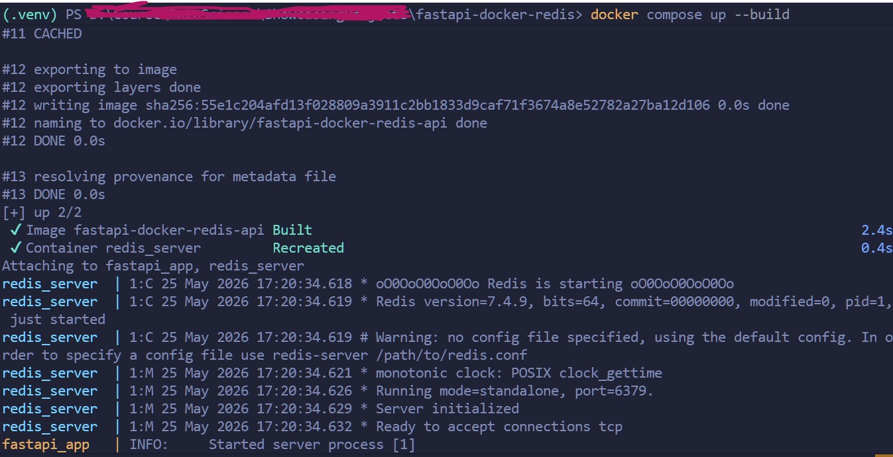
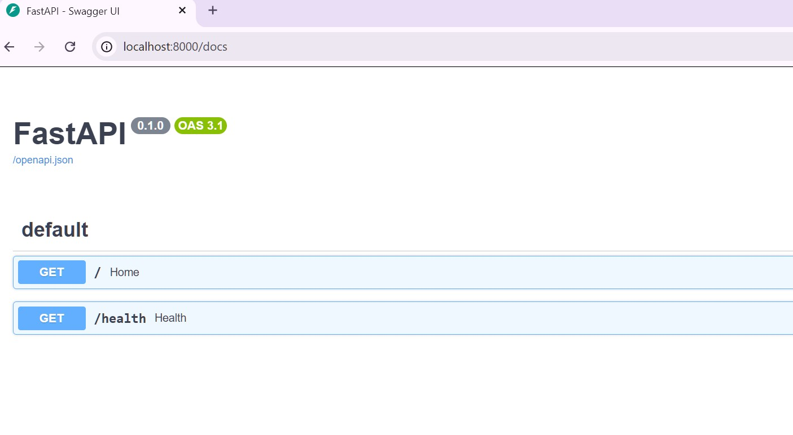
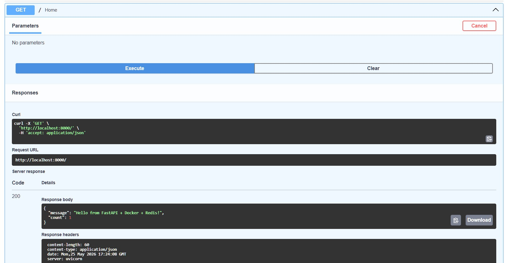

# 🚀 FastAPI + Redis + Docker Compose

A hands-on project demonstrating Docker fundamentals using a modern Python backend stack with **FastAPI**, **Redis**, and **Docker Compose**.

This project showcases:

* Docker containerization
* Dockerfile best practices
* Multi-container applications
* Docker networking
* Volumes & persistent storage
* Environment variables
* Health checks
* Redis integration
* FastAPI API development

---

# 🎯 Learning Objectives

This project was created to practice and understand:

- Docker containerization
- Docker Compose orchestration
- Multi-container networking
- Redis integration with FastAPI
- Persistent storage using Docker volumes
- Environment-based configuration
- Health checks and retry logic
- Docker layer caching and optimization

---

# 📌 Architecture

```text
Browser / API Client
          ↓
    FastAPI Container
          ↓
      Redis Container
          ↓
      Docker Volume
```


---

# 🛠️ Tech Stack

* Python 3.12
* FastAPI
* Uvicorn
* Redis
* Docker
* Docker Compose

---

# 📁 Project Structure

```text
fastapi-docker-redis/
│
├── app/
│   ├── main.py
│   └── requirements.txt
│
├── Dockerfile
├── docker-compose.yml
├── .dockerignore
└── README.md
```

---

# 🐳 Docker Concepts Demonstrated

## ✅ Docker Fundamentals

* Images vs Containers
* Build vs Runtime
* Container lifecycle

## ✅ Dockerfile

* Base image selection
* Layer caching optimization
* Dependency management
* CMD vs RUN

## ✅ Docker Networking

* Container-to-container communication
* Docker DNS/service discovery
* Port mapping

## ✅ Docker Compose

* Multi-container orchestration
* Shared networking
* Environment variables

## ✅ Storage

* Docker volumes
* Persistent Redis data
* Stateless API pattern

---

# ⚡ Features

* FastAPI REST API
* Redis-backed counter
* Health endpoint
* Persistent Redis volume
* Containerized deployment
* Swagger/OpenAPI documentation

---

# 📦 API Endpoints

---

## `GET /`

Returns a Redis-backed counter.

### Example Response

```json
{
  "message": "Hello from FastAPI + Docker + Redis!",
  "count": 1
}
```

---

## `GET /health`

Checks Redis connectivity.

### Example Response

```json
{
  "status": "healthy",
  "redis": "connected"
}
```

---

# 📄 Swagger Documentation

FastAPI automatically generates Swagger/OpenAPI docs.

Open:

```text
http://localhost:8000/docs
```

---

# 🐳 Docker Compose Configuration

This project uses:

* FastAPI container
* Redis container
* Docker-managed persistent volume
* Internal Docker networking

Containers communicate using Docker Compose service names.

Example:

```python
REDIS_HOST = "redis"
```

Docker Compose automatically creates internal DNS resolution.

---

# 🚀 Running the Project

---

## 1. Clone Repository

```bash
git clone <your-repo-url>
cd fastapi-docker-redis
```

---

## 2. Start Containers

```bash
docker compose up --build
```

---

## 3. Access Application

### API

```text
http://localhost:8000
```

### Health Check

```text
http://localhost:8000/health
```

### Swagger Docs

```text
http://localhost:8000/docs
```

---

# 📦 Docker Commands

---

## Start in Detached Mode

```bash
docker compose up -d
```

---

## Stop Containers

```bash
docker compose down
```

---

## View Logs

```bash
docker compose logs
```

---

## View Running Containers

```bash
docker compose ps
```

---

# 🔍 Important Learning Notes

---

## Why `0.0.0.0` Is Required

```python
uvicorn main:app --host 0.0.0.0
```

Allows external access from outside the container.

---

## Why `localhost` Does NOT Work Between Containers

Each container has its own network namespace.

Container-to-container communication uses:

```text
service-name:port
```

Example:

```text
redis:6379
```

NOT:

```text
localhost:6379
```

---

## Why Redis Uses Docker Volume

Without a volume:

* Redis data disappears when container is removed

With a volume:

* Data persists independently of containers

---

# 🧠 Key Docker Learnings From This Project

* Docker images are layered filesystem templates
* Containers are isolated runtime environments
* Docker Compose simplifies multi-container applications
* Volumes persist data outside container lifecycle
* Containers communicate via Docker networks and DNS
* Layer ordering improves Docker build cache efficiency

---

# 🛡️ Future Enhancements

* Multi-stage builds
* Healthcheck configuration
* Redis authentication
* Environment file (`.env`)
* CI/CD pipeline integration
* Kubernetes deployment
* FastAPI async Redis client
* Nginx reverse proxy

---
# Screenshots








---

# 📚 References

* [https://docs.docker.com/](https://docs.docker.com/)
* [https://fastapi.tiangolo.com/](https://fastapi.tiangolo.com/)
* [https://redis.io/docs/](https://redis.io/docs/)

---

# 👨‍💻 Author

Saket Pani

Hands-on learning project focused on Docker fundamentals, FastAPI, container networking, and modern backend development.
